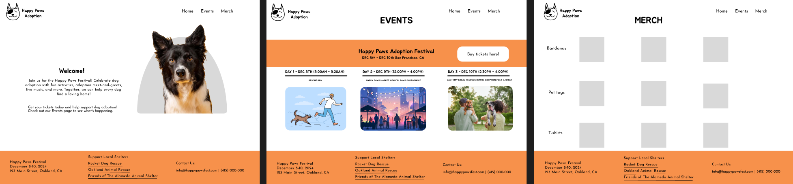

# DES 228 Project 3 Final: Festival Guide
**Happy Paws Adoption**  
**by Sydney Moy**  
December 2, 2024
# About
**Happy Paws Adoption** is a website designed to raise awareness about dog adoption, fostering, and volunteer opportunities at local shelters such as ***Rocket Dog Rescue*** and ***Oakland Animal Rescue.*** The festival aims to connect the **Oakland** community with ways to help reduce shelter overcrowding and provide loving homes for pets in need. By offering a platform for local shelters, the festival allows them to showcase adoptable dogs, promote volunteering, and foster compassion and responsibility toward animals in need.

The **Happy Paws Adoption Festival** is a **three-day event** that brings together dog lovers, local businesses, and adoption advocates. The festival will feature 5k run, meet-and-greet petting zones, and vendor markets, offering opportunities for education, inspiration, and enjoyment for animal lovers of all ages. This event is designed to highlight the importance of adoption, encourage community engagement, and provide a space to support local shelters.

Taking place in Oakland, Happy Paws Adoption Festival is scheduled for a weekend event, providing a vibrant setting for families, dog enthusiasts, and individuals interested in making a difference. This festival seeks to raise awareness while fostering a deeper commitment to animal welfare and the adoption process.

# Technical Overview
This website is designed with fundamentals of HTML and CSS. The site features:
* unique logo design
* flexbox/grid layout
* CSS Hover effects and transitions
* one responsive design for smaller screens

# Wireframe

[Figma Wireframe](https://www.figma.com/design/CQ1aVUOS7nKo4MJnsA2M7e/Happy-Paws-Adoption?node-id=0-1&t=hsi8DdQQ0qa7bSji-1)

# Acknowledgement
* [Josefin Sans](https://fonts.google.com/specimen/Josefin+Sans) typeface designed by Santiago Orozco, available on Google Fonts.
* [Jua](https://fonts.google.com/specimen/Jua) typeface designed by Woowahan Brothers, available on Google Fonts. 

* [Rocket Dog Rescue](https://rocketdogrescue.org) for their partnership in supporting the event.
* [Oakland Animal Services](https://www.oaklandanimalservices.org) for their partnership in supporting the event.

* [W3Schools CSS Round Buttons Tutorial](https://www.w3schools.com/howto/howto_css_round_buttons.asp), which provided guidance on creating rounded buttons with CSS.
* [CSSmatic Box Shadow Generator](https://www.cssmatic.com/box-shadow) - Used for generating box-shadow styles for the project.
* [W3Schools CSS Footer Tutorial](https://www.w3schools.com/howto/howto_css_footer_basic.asp) - Used for designing the footer structure and styles.
* [GeeksforGeeks - CSS Border-Left Property](https://www.geeksforgeeks.org/css-border-left-property/) - Referenced for the usage of the 'border-left' property in styling.
* [flex-shrink - MDN Web Docs](https://developer.mozilla.org/en-US/docs/Web/CSS/flex-shrink) for understanding how the `flex-shrink` property works in CSS flexbox layouts.
* [How to Create a Hover Underline Effect in CSS](https://www.youtube.com/watch?v=wh1FKjZt_H8)" navbar design on YouTube.
* [Adobe Stock](https://stock.adobe.com/search?load_type=search&is_recent_search=&search_type=usertyped&k=Dachshund+dog+silhouettes+running+in+various+poses+Ideas+for+dog+lovers&native_visual_search=&similar_content_id=&asset_id=426238707) dog silhoettes vector used in the gif.
* [Adobe Stock](https://stock.adobe.com/Library/urn:aaid:sc:VA6C2:236c0719-2740-426e-89c8-c58927f443e6?). All vectors, images, and mockups used in this project were sourced from adobe stock images. 

